<!-- Animated Header -->
<div align="center">
  
</div>

<!-- Dynamic Typing Animation -->
<div align="center">
  
</div>

<!-- Profile Stats -->
<div align="center">
  
  
  
</div>

---

<!-- About Me Section -->


## 👨‍💻 **About Me**

```javascript
const zahinTapadar = {
    name: "Zahin Tapadar",
    age: "17 years old",
    education: "12th Grade Student",
    location: "🌍 Building from anywhere",
    
    currentStatus: {
        learning: "Data Science & Machine Learning",
        working: "Portfolio Projects & Open Source",
        available: "For collaboration & freelance work"
    },
    
    expertise: {
        frontend: ["Next.js", "React", "SvelteKit", "Flutter UI"],
        mobile: ["React Native", "Flutter", "Swift"],
        backend: ["Express.js", "Firebase", "Node.js"],
        styling: ["Tailwind CSS", "CSS3", "Responsive Design"],
        languages: ["JavaScript", "TypeScript", "Swift", "Python"],
        tools: ["TensorFlow", "Matplotlib", "Unreal Engine", "GCP"],
        databases: ["Firebase", "MongoDB", "SQL"]
    },
    
    passion: "Turning innovative ideas into reality",
    motto: "Age is just a number, code is eternal! 🚀"
};

console.log("Ready to build something amazing together!");
```

---

<!-- Tech Stack with Cool Animations -->
## 🛠️ **My Tech Arsenal**

<div align="center">

### **Frontend Development** 


### **Mobile Development**


### **Backend & Cloud**


### **Languages & Tools**


### **Data Science & AI** (Currently Learning 📚)


### **Game Development**


</div>

---

<!-- Featured Portfolio -->
## 🌟 **Featured Work**

<div align="center">

<table>
<tr>
<td width="50%">
<h3>🎨 <strong>Portfolio Website</strong></h3>

[](https://zahintapadar.onrender.com/)

**Built with cutting-edge tech:**
- ⚡ Next.js for blazing performance
- 🎨 Modern UI/UX design
- 📱 Fully responsive layout
- 🚀 Deployed on Render

*"Showcasing my journey from ideas to reality"*

</td>
<td width="50%">
<h3>📱 <strong>Mobile Apps</strong></h3>

[](https://github.com/falkon2)

**Cross-platform excellence:**
- 📱 Flutter mobile applications
- 🍎 Native iOS Swift apps
- ⚛️ React Native projects
- 🎯 Focus on user experience

*"Building apps that users love"*

</td>
</tr>
</table>

</div>

---

<!-- GitHub Stats -->
## 📊 **GitHub Analytics**

<div align="center">
  


</div>

---

<!-- Activity Graph -->
<div align="center">
  
</div>

---

<!-- Current Learning Path -->
## 🎯 **Learning Journey**

```mermaid
graph TD
    A[🎓 12th Grade Student] --> B[💻 Full-Stack Development]
    B --> C[📱 Mobile App Development]
    C --> D[🤖 Data Science & AI]
    D --> E[🚀 Future Tech Leader]
    
    B --> F[Next.js & React]
    B --> G[Flutter & Swift]
    B --> H[Firebase & Cloud]
    
    D --> I[TensorFlow]
    D --> J[Machine Learning]
    D --> K[Data Analysis]
    
    style A fill:#ff6b6b
    style D fill:#4ecdc4
    style E fill:#45b7d1
```

<div align="center">



</div>

---

<!-- Connect With Me -->
## 🌐 **Let's Connect & Collaborate!**

<div align="center">

### **📬 Get In Touch**
[](https://zahintapadar.onrender.com/)
[](mailto:eufalkon@gmail.com)

### **🤝 Professional Networks**
[](https://www.linkedin.com/in/zahin-tapadar-524640243/)
[](https://github.com/falkon2)
[](https://www.kaggle.com/zahinahmedtapadar)

</div>

---

<!-- What I'm Up To -->
## 🚀 **What I'm Currently Doing**

<div align="center">

| 🎯 **Focus Area** | 📝 **Current Activity** | 🎨 **Tech Stack** |
|:---:|:---:|:---:|
| 📚 **Learning** | Data Science & Machine Learning | Python, TensorFlow, Pandas |
| 💻 **Building** | Portfolio Projects & Web Apps | Next.js, React, Firebase |
| 📱 **Developing** | Mobile Applications | Flutter, Swift, React Native |
| 🤝 **Collaborating** | Open Source Contributions | Various Technologies |
| 🎓 **Studying** | 12th Grade + Self-Learning | Computer Science Concepts |

</div>

---

<!-- Fun Facts -->
## 🎉 **Fun Facts About Me**

<div align="center">

```typescript
interface StudentDeveloper {
    age: number;
    passion: string[];
    availableFor: string[];
    currentGoal: string;
    superpower: string;
}

const zahin: StudentDeveloper = {
    age: 17,
    passion: [
        "Building innovative apps",
        "Learning cutting-edge tech",
        "Solving real-world problems",
        "Collaborating with amazing developers"
    ],
    availableFor: [
        "💼 Freelance projects",
        "🤝 Open source collaboration", 
        "📚 Mentoring & learning together",
        "🚀 Startup opportunities"
    ],
    currentGoal: "Master Data Science while excelling in 12th grade!",
    superpower: "Turning caffeine into code at 3 AM ☕"
};
```

</div>

---

<!-- Quote Section -->
<div align="center">
  
</div>

---

<!-- Snake Game -->
<div align="center">
  
</div>

---

<!-- Contribution Calendar -->
<div align="center">
  
</div>

---

<!-- Footer -->
<div align="center">
  
</div>

<div align="center">
  <h2>🌟 **"Age is just a number, dreams have no expiration date!"** 🌟</h2>
  <p><b>💜 Thanks for visiting my profile! Let's build the future together!</b></p>
  <p><i>⭐ Star my repos if you find them interesting • 🤝 Always open to collaboration</i></p>
  
  
</div>
